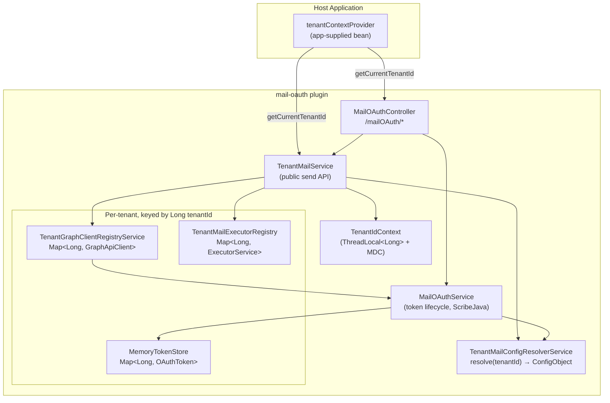
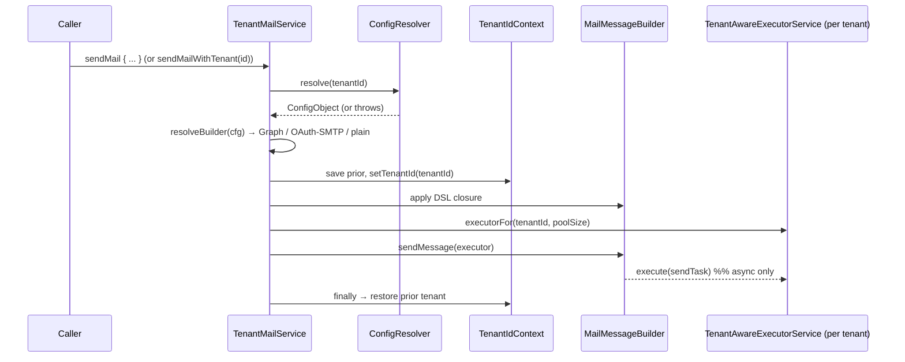

# Multi-Tenancy Architecture — mail-oauth

This document describes how the `mail-oauth` plugin supports **multi-tenancy**: a single
application instance sending and reading mail for many tenants, each with its own Microsoft
Entra ID application, credentials, mailbox, OAuth tokens, and dispatch threads.

> **Two distinct "tenant" concepts — do not conflate them:**
> - **Application tenant id** — a `Long` identifying *your* tenant (organization/customer) inside
>   the host application. Everything in this plugin is partitioned by this value.
> - **`grails.mail.oAuth.tenant_id`** — the *Microsoft Entra ID (Azure AD)* directory id (or
>   `common`) used when talking to Microsoft. It is one property *inside* a tenant's mail config.
>
> Throughout this document, "tenant" / `tenantId` means the **application** tenant id unless
> stated otherwise.

---

## 1. Overview


### Architecture Flow

```text
                     +--------------------------------------+
                     |        Host Application              |
                     |                                      |
                     |  tenantContextProvider               |
                     |  (app-supplied bean)                 |
                     +----------------+---------------------+
                                      |
                     getCurrentTenantId
                     /                \
                    v                  v
      +-----------------------+   +---------------------------+
      | MailOAuthController   |   | TenantMailService         |
      | /mailOAuth/*          |-->| (public send API)         |
      +-----------+-----------+   +-----+----+-----+----------+
                  |                     |    |     |
                  |                     |    |     |
                  |                     |    |     +------------------+
                  |                     |    |                        |
                  |                     |    v                        v
                  |                     | TenantIdContext     TenantMailExecutorRegistry
                  |                     | (ThreadLocal+MDC)   Map<TenantId, Executor>
                  |                     |
                  |                     v
                  |        TenantMailConfigResolverService
                  |          resolve(tenantId) → ConfigObject
                  |
                  v
      +----------------------------------------------+
      | MailOAuthService                             |
      | (token lifecycle, ScribeJava)                |
      +-----------+------------------------+---------+
                  |                        ^
                  |                        |
                  v                        |
         MemoryTokenStore          TenantGraphClientRegistryService
      Map<TenantId, OAuthToken>    Map<TenantId, GraphApiClient>
```

Every request-scoped operation resolves the **current tenant** first, resolves that tenant's
**mail config**, then operates against that tenant's **tokens / Graph client / thread pool**.

---

## 2. Establishing the current tenant

The plugin does **not** know how the host application determines the current tenant. The host must
register a Spring bean named **`tenantContextProvider`**:

```groovy
package grails.plugins.tenant

interface TenantContextProvider {
    Long getCurrentTenantId()
}
```

```groovy
// consuming app — grails-app/conf/spring/resources.groovy
beans = {
    tenantContextProvider(com.example.AppTenantContextProvider)
}
```

`MailOAuthController` and `TenantMailService.sendMail(Closure)` both call `getCurrentTenantId()`.
Background jobs with no request context should instead call the explicit
`TenantMailService.sendMailWithTenant(tenantId) { … }`.

### TenantIdContext — carrying the tenant into deeper layers

`grails.plugins.tenant.TenantIdContext` is a `ThreadLocal<Long>` (mirrored into SLF4J `MDC` under
the `tenantId` key, so logs are automatically tenant-tagged). It lets senders and token-refresh
code read the tenant without threading it through every method signature.

**Lifecycle rules:**
- Controllers set it at the start of an action and **clear it in a `finally`**.
- `TenantMailService.sendMailWithTenant` captures the caller's prior value, sets the target tenant,
  and **restores the prior value in a `finally`** — so a direct (non-controller) call does not leave
  a stale tenant id on a pooled thread.
- `TenantAwareExecutorService` re-establishes the submitting thread's tenant inside each worker
  thread and clears it when the task finishes (see §5).

---

## 3. Per-tenant configuration resolution

`TenantMailConfigResolverService.resolve(tenantId)`:

1. **Reject** a null `tenantId` (`IllegalArgumentException`).
2. If `tenantId == grails.DEFAULT_TENANT_ID` → use **organization-level** config at `grails.mail`.
3. Otherwise → use **tenant-specific** config at the top-level `tenant_<tenantId>.grails.mail` block.
4. Merge `host` / `port` / `props` from the global `grails.mail` as **defaults** (tenant values win).
5. If nothing resolves, throw `IllegalStateException`.

```groovy
// application.groovy (consuming app)
grails.DEFAULT_TENANT_ID = 1

// org-level (used when current tenantId == DEFAULT_TENANT_ID)
grails.mail.username          = 'shared@org.com'
grails.mail.oAuth.enabled     = true
grails.mail.oAuth.graph.enabled = true
grails.mail.oAuth.client_id   = '...'
grails.mail.oAuth.secret_val  = '...'                 // externalize; never commit
grails.mail.oAuth.tenant_id   = '<entra-directory-id>'

// application tenant 42
tenant_42.grails.mail.username        = 'noreply@tenant42.com'
tenant_42.grails.mail.oAuth.enabled   = true
tenant_42.grails.mail.oAuth.graph.enabled = true
tenant_42.grails.mail.oAuth.client_id = '...'
tenant_42.grails.mail.oAuth.secret_val = '...'
tenant_42.grails.mail.oAuth.tenant_id = '<tenant42-entra-directory-id>'
```

> ⚠️ **`DEFAULT_TENANT_ID` must be set** for the org-level `grails.mail` block to ever be selected.
> If it is unset, the default id is `null`, no incoming `tenantId` matches it, and every tenant must
> have a `tenant_<id>` block or resolution fails with `IllegalStateException`.

---

## 4. Send flow and strategy selection

`TenantMailService` is the public entry point and mirrors the Grails Mail `sendMail` DSL.



`resolveBuilder` picks the strategy from the resolved config:

| Resolved tenant config                        | Strategy                                   | Sender                 |
|-----------------------------------------------|--------------------------------------------|------------------------|
| `oAuth.enabled` **and** `oAuth.graph.enabled` | Microsoft Graph API send                   | `GraphMailSenderImpl`  |
| `oAuth.enabled` only                          | OAuth-secured SMTP (`XOAUTH2`)             | `OAuthMailSenderImpl`  |
| neither                                       | Plain SMTP (standard Grails Mail)          | `MailMessageBuilder`   |

The actual send is dispatched on the tenant's own thread pool. Grails Mail's
`MailMessageBuilder.sendMessage(ExecutorService)` runs asynchronously via `executorService.execute`
only when `async` is configured; otherwise it sends synchronously on the caller thread.

---

## 5. Per-tenant runtime isolation

| Concern            | Component                          | Isolation mechanism                                                                 |
|--------------------|------------------------------------|-------------------------------------------------------------------------------------|
| OAuth tokens       | `MemoryTokenStore`                 | `ConcurrentHashMap<Long, OAuthToken>` keyed by tenant id                            |
| Graph client       | `TenantGraphClientRegistryService` | one cached `GraphApiClient` per tenant, keyed by a signature of the OAuth config; rebuilt under a per-tenant `ReentrantLock` when the signature changes |
| Dispatch threads   | `TenantMailExecutorRegistry`       | one `ThreadPoolExecutor` per tenant (threads named `tenant-mail-<id>`), wrapped by `TenantAwareExecutorService` |

**`TenantAwareExecutorService`** wraps every task-submission method (`execute`, all `submit`
overloads, `invokeAll`, `invokeAny`). Each wrapper captures the submitting thread's `tenantId`,
re-establishes it inside the worker thread before running the task, and clears it afterward — so
async sends run under the correct tenant and pooled worker threads never leak a tenant id between
tasks.

---

## 6. Token lifecycle (per tenant)

`MailOAuthService` drives the OAuth 2.0 lifecycle; all storage is keyed by tenant id:

- **Authorize** — `generateAuthCodeURL()` builds the Microsoft authorization (or admin-consent, for
  `daemon` apps) URL. The OAuth `state` is encoded with the tenant id
  (`MailOAuthUtil.buildOAuthState` / `parseState`) so the stateless `callback` can recover which
  tenant a redirect belongs to.
- **Exchange** — `generateAccessToken(code, state, …)` validates the returned `state` against the
  stored value (mismatch → exception), exchanges the code, and stores an `OAuthToken` for the tenant.
- **Use / refresh** — `getAccessToken()` reads the current tenant's token and auto-refreshes when
  expired (`refreshAccessToken`). `daemon` mode uses the client-credentials grant instead of a
  refresh token.
- **Revoke** — `revokeToken()` clears the local store first, then best-effort revokes the refresh
  and access tokens at Microsoft.

`daemon` mode (`grails.mail.oAuth.daemon`) switches interactive auth-code flow for the
client-credentials / admin-consent flow used by app-only (shared mailbox) senders.

---

## 7. Reader side (Graph / IMAP)

The email-reader services (`GraphEmailReaderService`, `ImapEmailReaderService`) are optional and
enabled independently (`grails.mail.reader.*`). They use their own `GraphConfig`/`ImapConfig`
objects and a separate `readerTokenStoreService`, plus a separate OAuth callback
(`ReaderTokenController`, `/readerToken/callback`). See `examples/` for runnable usage scripts.

> The reader side is **less tenant-integrated than the sender**: it is driven by explicit
> `GraphConfig` objects rather than the `tenant_<id>` resolution path, and its OAuth callback does
> not yet validate `state`. See §8.

---

## 8. Known limitations & recommendations

| Area | Limitation | Recommendation |
|------|-----------|----------------|
| Token durability | `MemoryTokenStore` is in-process only — tokens are **not shared across cluster nodes** and are **lost on restart** (forcing re-consent). | For clustered / HA deployments, provide a shared/persistent `TokenStore` implementation (DB or Redis) and register it in place of `MemoryTokenStore`. The `TokenStore` interface already abstracts this. |
| Lock map growth | `TenantGraphClientRegistryService.tenantLocks` accumulates one lock per tenant and is not pruned by `evict`/`evictAll`. | Prune `tenantLocks` alongside the client cache on eviction if tenant counts are very high. |
| Reader multi-tenancy | Reader OAuth callback does not validate `state`, and reader config is not resolved through `tenant_<id>`. | Add `state` validation and, if per-tenant reader mailboxes are needed, route reader config through `TenantMailConfigResolverService`. |
| Config prerequisite | Org-level `grails.mail` is only used when `DEFAULT_TENANT_ID` is set. | Always set `grails.DEFAULT_TENANT_ID` in the host app, or give every tenant a `tenant_<id>` block. |

---

## 9. Key types (quick reference)

| Type | Package | Role |
|------|---------|------|
| `TenantContextProvider` | `grails.plugins.tenant` | **App-supplied** — resolves current `Long` tenant id |
| `TenantIdContext` | `grails.plugins.tenant` | ThreadLocal + MDC carrier for the tenant id |
| `TenantMailService` | `grails.plugins.mail.oauth` | Public tenant-aware send API |
| `TenantMailConfigResolverService` | `grails.plugins.mail.oauth` | Resolves per-tenant mail `ConfigObject` |
| `MailOAuthService` | `grails.plugins.mail.oauth` | Per-tenant OAuth token lifecycle |
| `TenantGraphClientRegistryService` | `grails.plugins.mail.oauth` | Per-tenant `GraphApiClient` cache |
| `TenantMailExecutorRegistry` | `grails.plugins.mail.tenant` | Per-tenant thread pools |
| `TenantAwareExecutorService` | `grails.plugins.mail.tenant` | Propagates tenant id into worker threads |
| `TenantOAuthContext` | `grails.plugins.mail.tenant` | Per-call bundle of ScribeJava service + tenant flags |
| `MemoryTokenStore` / `TokenStore` | `grails.plugins.mail.oauth.token` | Per-tenant token storage (in-memory default) |
